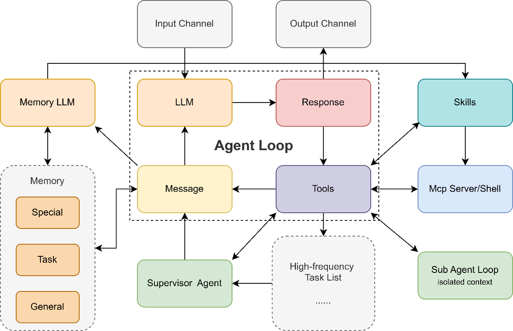
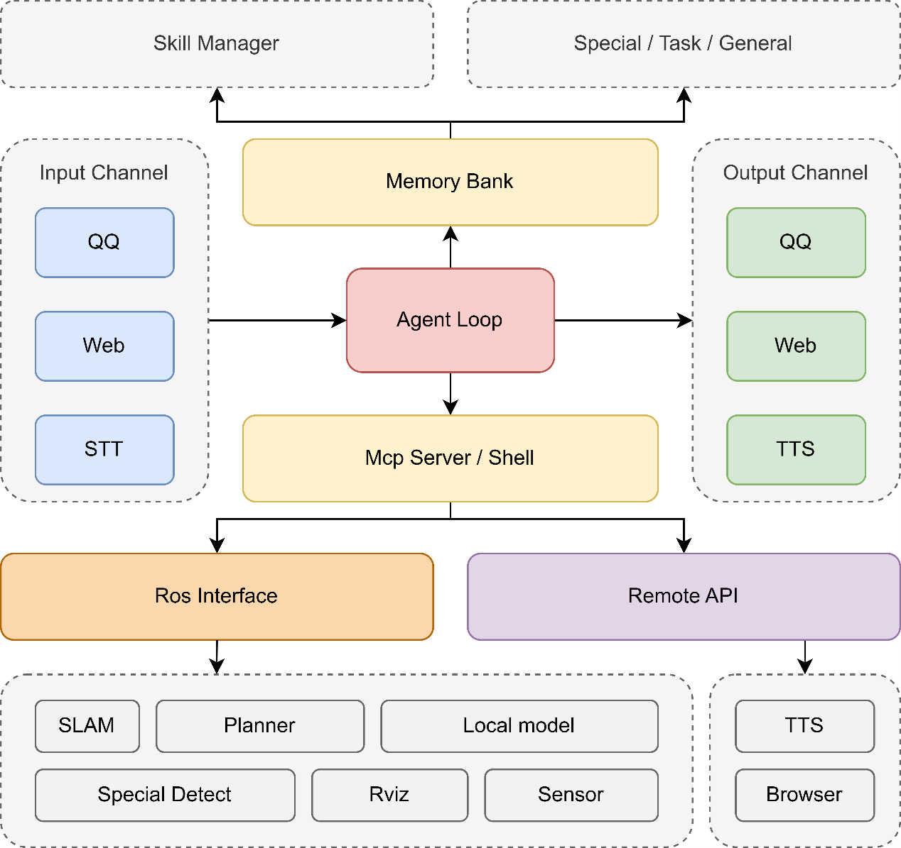

# Embodied Multi-Robot Agent Framework

An embodied multi-robot intelligence framework for general environments.

This project is forked from [`nanobot`](https://github.com/HKUDS/nanobot) and is being extended from a lightweight general-purpose agent into a robotics-oriented embodied agent framework deeply integrated with ROS.

## Vision

This project aims to make agent systems useful in the physical world, not only in text-only or image-only workflows.

The core direction is:

- Deep integration between an agent loop and ROS tooling
- Faster interaction with the physical world through structured robot interfaces instead of pure text reasoning
- Reusable skills for navigation, exploration, human teaching, and task execution
- Reflection, self-correction, interruption recovery, and long-horizon task continuity
- Multi-robot collaboration across quadrupeds, humanoids, arms, and simulators

## What Makes It Different

Compared with the current `nanobot` baseline, this project focuses on embodied execution speed, spatial understanding, and robot task continuity.

Key characteristics:

- ROS-native perception and action
  The agent should use ROS interfaces, visualization tools, maps, trajectories, and sensor data directly instead of relying only on text or screenshots.
- Skill-centric embodied intelligence
  Exploration policies, spatial priors, navigation routines, and task procedures should be summarized into reusable skills instead of being rediscovered every time.
- Human-in-the-loop teaching
  The system should support map display, multi-turn teaching, guided demonstrations, and converting demonstrations into executable skills.
- Reflection and recovery
  When a task fails, the agent should reflect, switch skills, fall back to atomic actions, and continue exploring instead of getting stuck in one routine.
- Multi-robot coordination
  Quadrupeds, humanoids, robot arms, and simulators should collaborate through shared task decomposition, communication, and execution.
- Self-improving skills
  Skills should be summarized, edited, optimized, and eventually evolved from experience.
- Interruptible long-running tasks
  A robot should pause task A safely, switch to task C, and later resume task A from a recoverable node.

## Target Platforms and Scenarios

### Robots

- Quadruped robots
- Humanoid robots
- Robot arms
- Simulators for evaluation and future training

### Core Scenarios

- Quadruped exploration and object search
- Reception and guided navigation
- Multi-robot collaborative work
- Human-robot cooperative interaction

### Demo Tasks

1. Museum safety and child assistance
   A quadruped patrols a museum, detects a lost child, provides emotional comfort, and requests a humanoid robot for coordinated help. If the original route is blocked, the robots re-plan and escort the child safely to a service desk.
2. Office service with interruption and recovery
   A quadruped is delivering water with the help of a desktop arm. Before pouring, a high-priority wake-up task interrupts execution. The arm unloads and stores the cup, the quadruped completes the urgent task, then returns to resume the water delivery workflow safely.
3. Home skill learning and self-improvement
   A humanoid fails at folding clothes. A human demonstrates the task, the robot summarizes the demonstration into a new skill, succeeds once, then adapts the skill when a similar but more slippery cloth causes grasp failure.

## Core Capabilities

- Spatial perception and spatial memory
- Task memory with CRUD, stacking, reconstruction, and recovery
- Reflection and self-correction during task execution
- Skill summarization, optimization, and evolution
- Multi-agent and multi-robot communication
- Multimodal interaction through voice, gestures, demonstrations, maps, and photos
- Lightweight supervision agents for fast runtime monitoring
- ROS-aligned UI tools exposed in an MCP-style interface

## Architecture Direction

### Agent Loop Extension

This project extends the original lightweight agent loop with:

- Memory-oriented side loops
- Supervisor agents for high-frequency oversight
- Skills as first-class execution units
- Tool and MCP integration for robot control and world interaction
- Optional sub-agents for isolated execution contexts

### ROS-Centric Robotics Architecture

The robotics stack is organized around:

- Input channels such as web, speech-to-text, and operator commands
- An agent loop connected to a memory bank and skill manager
- MCP or shell style tool interfaces
- ROS interfaces for SLAM, planning, sensing, RViz, detection, and motion control
- Remote APIs for browser and TTS style integrations

## Planned ROS Interfaces

### Motion

- Navigate to a target 3D pose
- Waypoint server with create, read, update, delete, and navigate operations
- Navigate to a clicked 2D point in view
- Follow mode
- Trajectory recording and replay
- Atomic actions
- VLN tasks
- Query current pose
- Autonomous exploration

### Sensing

- Get camera images
- Trigger object detection
- Sound source perception

### Other Abilities

- Trigger speech-to-text
- Text-to-speech

## Memory and Skill Design

### Spatial Memory

Spatial memory is currently planned as a skill-oriented subsystem with explicit storage and retrieval interfaces.

Candidate directions:

1. Occupancy prediction plus clustering pipelines, potentially informed by work such as EmbodiedOcc
2. An LLM-guided memory system that decides what should be stored
3. Structured scene memory inspired by concept graph style representations

### Task Memory

Task memory should support:

- Insert, delete, update, and query
- Task stack management
- Full task reconstruction
- Interrupt and resume checkpoints
- Safe recovery after failure or reassignment

### Skill Pipeline

The long-term goal is a dedicated memory and optimization pipeline for skills:

- Record task procedures
- Summarize successful workflows into skills
- Detect failures and weak steps
- Rewrite or tune skills after execution
- Support self-modification and self-evolution

## Implementation Roadmap

1. Keep multimodal inputs in the current tool-based form for now
2. Add a simple spatial memory system with CRUD-style interfaces
3. Add task memory and interruption-resume state management
4. Build a skill summarization and optimization pipeline backed by dedicated memory
5. Wrap key ROS tools and visual interfaces as MCP-compatible tools
6. Introduce a lightweight local supervision agent for fast runtime checks
7. Evaluate whether sub-agents are necessary for embodied control and when they should be activated

## TODO

- [ ] Define the first version of the spatial memory schema and APIs
- [ ] Implement task memory with stack, checkpoint, and recovery primitives
- [ ] Expose core ROS actions as tools or MCP servers
- [ ] Add map visualization and operator-facing UI tools
- [ ] Add demonstration-to-skill teaching workflow
- [ ] Add reflection and skill-switching after task failure
- [ ] Add interruption-safe task suspension and resume
- [ ] Add multi-robot communication and coordination primitives
- [ ] Add skill editing, optimization, and self-evolution pipeline
- [ ] Add a lightweight local supervisor model for runtime monitoring
- [ ] Implement the three demo scenarios as end-to-end benchmarks
- [ ] Add simulator support for repeatable evaluation and future training

## Status

This repository is under active development. The current codebase still contains inherited `nanobot` structure, but the long-term goal is to evolve it into a general embodied multi-robot collaboration framework for real-world environments.
